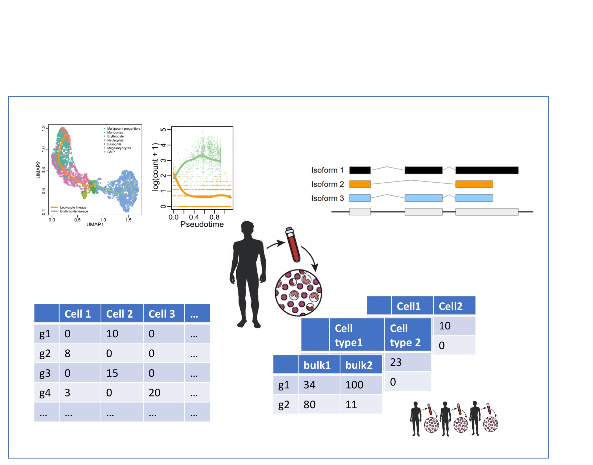

```{r setup, include=FALSE, cache=FALSE}
knitr::opts_chunk$set(echo = FALSE)
```

***

```{r}

```


### Course Description

Modern high throughput technologies easily generate data on thousands of variables; e.g. genomics, chemometrics, environmental monitoring, ... Conventional statistical methods are no longer suited for effectively analysing such high-dimensional data. Multivariate statistical methods may be used, but for often the dimensionality of the data set is much larger than the number of (biological) samples. Modern advances in statistical data analyses allow for the appropriate analysis of such data.  Methods for the analysis of high dimensional data rely heavily on multivariate statistical methods. Therefore a large part of the course content is devoted to multivariate methods, but with a focus on high dimensional settings and issues.  Multivariate statistical analysis covers many methods. In this course, only a few are discussed. A selection of techniques is made based on our experience that they are frequently used in industry and research institutes (e.g. principal component analysis, cluster analysis, classification methods). Central in the course are applications from different fields (analytical chemistry, ecology, biotechnology, genomics, …).

### Prerequisites

The prerequisites for the High Dimensional Data Analysis course are the successful completion of a basic course of statistics that covers topics on data exploration and descriptive statistics, statistical modeling, and inference: linear models, confidence intervals, t-tests, F-tests, anova, chi-squared test.

The basis concepts may be revisited in my online course <https://gtpb.github.io/PSLS20/> (English) and in <https://statomics.github.io/statistiekCursusNotas/> (Dutch).

A primer to R and Data visualisation  in R can be found in:

- R Basics: <https://dodona.ugent.be/nl/courses/335/>

- R Data Exploration: <https://dodona.ugent.be/nl/courses/345/>

### Issues

If you encounter any problems related to the course material (e.g. package installation problems, bugs in the code, typos, ...), please consider [posting an issue on GitHub](https://github.com/statOmics/HDA2020/issues).

Questions related to the course contents can be asked by posting on [UFora](https://ufora.ugent.be/d2l/le/221212/discussions/topics/23086/View), by contacting the teachers by email or during the lectures or practical sessions.

---

### Topics

#### 1. Introduction

  - Slides: [Lecture 1: Intro](slides/IntroHighDim.pdf)
  - Software: [Install and Launch Statistical Software](./software4stats.html)
  - [Introduction](./intro.html)
  - [Introduction to RMarkdown](./Introduction-RMarkdown.html)
  - [Introduction to matrices in R](./Introduction-Matrices-R.html)


#### 2. Singular value decomposition

  - [Lecture 2-3: Singular value decomposition](./svd.html)
  - [Lab 1: Introduction and SVD applications](./Lab1-Intro-SVD.html)
  - [Lab 2: PCA](./Lab2-PCA.html)

#### 3. Prediction with High Dimensional Predictors

  - [Lecture 4-5: Prediction Theory](./prediction.html)
  - [Lab 3: Penalized regression and prediction](./Lab3-Penalized-Regression.html)

#### 4. Sparse Singular Value Decomposition

  - [Lecture 5: Sparse SVD](./sparseSvd.html)

#### 5. Linear discriminant analysis

  - [Lecture 5: Linear Discriminant Analysis Theory](./lda.html)
  - [Lab 4: Sparse PCA and LDA](./Lab4-Sparse-PCA-LDA.html)

#### 6. Large Scale inference

  - [Lecture 6: Large Scale Inference](./lsi.html)

#### Paper Reading Session I: Introduction to Clustering

  - Paper reading session 1, November 12 2020. [Paper: Fraley and Raftery (1998). How Many Clusters? Which Clustering Method? Answers Via Model-Based Cluster Analysis. The Computer Journal, (41)8:578-588.](https://sites.stat.washington.edu/people/raftery/Research/PDF/fraley1998.pdf)
  - [Paper Reading Session I: Introduction to Hierarchical Clustering](./hclust.html)
  - [EM algorithm](./em.html)

### Homework assignments

- [Homework: Canonical Correlation Analysis](./HW-CCA.html)
- [Group Project](./Project.html)

